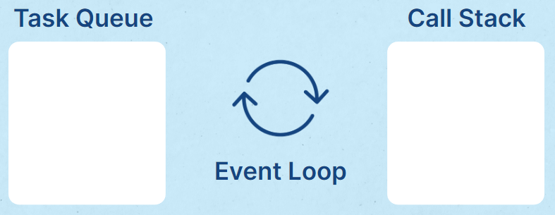

No cotidiano da pessoa desenvolvedora front-end suas tarefas envolvem desenvolver vários tipos de funções: as que acontecem a partir de alguma ação do usuário, as que carregam dados externos (geralmente recebidos através de uma API), entre outras.

**Por padrão o JavaScript funciona de modo síncrono**, executando as tarefas linha a linha. Funções como as descritas anteriormente podem atrasar essa execução por terem um tempo de espera relativo a fatores externos (como o usuário ou a API). Para isso não afetar o nosso projeto, temos o que é chamado de **programação assíncrona**.

A assincronicidade em programação é o ato de executar uma tarefa em “segundo plano”, para a execução das outras tarefas menores acontecerem enquanto a maior está sendo carregada, sem interromper o código. O javascript tem o comportamento de executar uma coisa por vez, mesmo se transformarmos trechos de código em assíncrono. Mas como funciona isso?

Podemos destrinchar o fluxo de execução de tarefas em JavaScript em três partes: Event Loop, Call Stack e Task Queue. O **Event Loop** é um ciclo que monitora e executa as ações que mandamos para o JavaScript. O processo de leitura do código só é finalizado quando não existem mais ações a serem executadas. A **call stack** é um mecanismo que organiza como irá funcionar o script quando existem muitas funções: qual função está sendo executada, quais estão sendo chamadas dentro de alguma função, etc. Por fim, a **task queue** é a fila de tarefas assíncronas. Se algo precisa ocorrer em segundo plano ou mais tarde, é nessa fila que ele será adicionado e executado mais tarde.