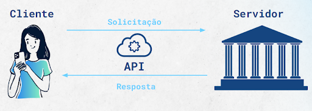

API é uma sigla que significa Interface de Programação de Aplicações. Uma API é um mecanismo que permite que duas partes de um software se comuniquem usando um conjunto de definições e protocolos. Sua arquitetura geralmente é explicada em termos de cliente e servidor. A aplicação que envia a solicitação é chamada de cliente e a aplicação que envia a resposta é chamada de servidor.

